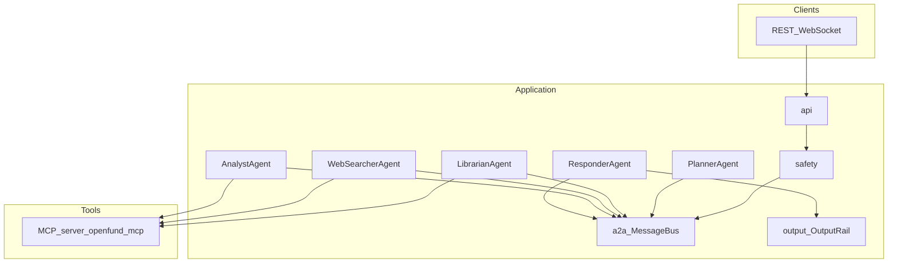

# OpenFund-AI

**OpenFund-AI** is a **multi-agent investment research backend**: it takes a natural-language question, runs it through a **Planner** and specialist agents (**Librarian**, **WebSearcher**, **Analyst**), gathers evidence via **MCP tools** (vector DB, graph, SQL, market data, news), and returns **one profile-tailored answer** through a **Responder**—with **safety** on input and **compliance** checks on output. The product surface is **API-first** (FastAPI REST + WebSocket); there is no first-party web UI in this repo.

---

## Purpose and goals

- **Problem:** Users need investment-research answers suited to their expertise—not a one-size-fits-all paragraph.
- **Approach:** Orchestrated research (one or more planner rounds), **external data only through MCP**, single component produces the final user-facing text, explicit **timeouts** and error paths.
- **User profiles** (shape tone and depth of the answer):
  - `beginner` — conclusion-first, minimal jargon, risk awareness
  - `long_term` — horizons, trends, drawdown-style framing
  - `analyst` — rigor, metrics, assumptions where applicable

**Product scope** (current phase) is summarized in [docs/workflow/90_product/prd.md](docs/workflow/90_product/prd.md): single conversational turn per request, optional `conversation_id` for continuity/polling, no token streaming to the client, no bundled UI.

---

## Architecture (design)

### Layered flow



- **A2A (agent-to-agent):** FIPA-style **ACL messages** on an in-memory **message bus** (`a2a/`). Performatives include REQUEST, INFORM, STOP, etc.
- **Hub-and-spoke:** Only the **Planner** orchestrates; specialists reply to the Planner. The **Responder** produces the final answer and ends the conversation (STOP).
- **MCP:** All access to PostgreSQL, Neo4j, Milvus, market/news/file tools goes through **`openfund_mcp`** (FastMCP). The API spawns the MCP server as a subprocess and talks over stdio (`openfund_mcp/mcp_client.py`). External clients can run `python -m openfund_mcp` the same way.
- **LLM:** Used for task decomposition, specialist tool selection, planner sufficiency/refinement, and responder formatting when configured. See [docs/workflow/02_planning/backend.md](docs/workflow/02_planning/backend.md) for timeouts (`LLM_TIMEOUT_SECONDS`, `E2E_TIMEOUT_SECONDS`).

**Package roles** (high cohesion / low coupling) are documented in [docs/workflow/02_planning/dependency-contract.md](docs/workflow/02_planning/dependency-contract.md). Code map: [docs/workflow/02_planning/file-structure.md](docs/workflow/02_planning/file-structure.md).

---

## Data

### What lives where

| Area | Role |
|------|------|
| [`database/stats_data/`](database/stats_data/) | CSV sources for **PostgreSQL** (stats/metrics tables) |
| [`database/graph_data/neo4j_export/`](database/graph_data/neo4j_export/) | Normalized **Neo4j** bundle (`graph_nodes.csv`, `graph_relationships.csv`, …) |
| [`database/text_data/`](database/text_data/) | JSON inputs for **Milvus** / text indexing |
| [`database/agent_heuristics.json`](database/agent_heuristics.json) | Shared heuristics (WebSearcher/planner/analyst hints) |
| [`database/symbol_resolution_*.json`](database/) | Curated symbol resolution (aliases, issuers, routing) |
| `memory/` (default `MEMORY_STORE_PATH`) | Runtime persistence: conversations, users, optional user/situation memory, symbol resolution cache |

### Loading data into backends

**Supported ingestion path:** [scripts/data_loader.py](scripts/data_loader.py) — loads from `database/*` into SQL / Neo4j / Milvus when those services are configured. Schema and loader behavior: [docs/data_prep/revision_plan.md](docs/data_prep/revision_plan.md), [stats-data-schema.md](docs/data_prep/stats-data-schema.md), [graph-data-schema.md](docs/data_prep/graph-data-schema.md), [text-data-schema.md](docs/data_prep/text-data-schema.md).

```bash
python scripts/data_loader.py --load-mode existing
# Full rebuild (destructive); Neo4j mode tunable via NEO4J_FRESH_IMPORT_MODE
python scripts/data_loader.py --load-mode fresh-all
```

Optional Neo4j tooling: `scripts/load_neo4j_graph_bundle.py` (validate/load/probe)—see command table below.

---

## Installation

### Prerequisites

- **Python 3.11+** ([pyproject.toml](pyproject.toml) `requires-python`)
- Optional: Docker or local installs for **PostgreSQL**, **Neo4j**, **Milvus** when you want real backends (otherwise many tools return mocks/empty results).

### Steps

1. Clone the repository and `cd` to the project root.
2. Create and activate a virtual environment:
   ```bash
   python3 -m venv .venv
   source .venv/bin/activate   # Windows: .venv\Scripts\activate
   ```
3. Install the package and extras:
   ```bash
   pip install -e .
   pip install -e ".[dev]"       # ruff, black, pytest, …
   pip install -e ".[llm]"       # live LLM (OpenAI-compatible / DeepSeek, etc.)
   pip install -e ".[backends]"  # drivers for Postgres, Neo4j, Milvus as needed
   ```
4. Environment:
   ```bash
   cp .env.example .env
   ```
   Reference: [docs/shared/ENV.md](docs/shared/ENV.md). **`LLM_API_KEY`** is required for full live behavior at startup in the typical API path.

---

## How to run

### Recommended: one command

```bash
./scripts/run.sh
```

This can copy `.env` from `.env.example`, optionally install extras (`--install-deps`), optionally start local backends, optionally load funds (`--funds existing|fresh-symbols|fresh-all|skip`), then start the **API** and, by default, the **terminal chat client**. Use **`--no-chat`** for API only.

**Windows:** `powershell -ExecutionPolicy Bypass -File .\scripts\run.ps1` (same flags as below).

Common flags:

```bash
./scripts/run.sh --help
./scripts/run.sh --port 8010
./scripts/run.sh --no-backends
./scripts/run.sh --funds existing
./scripts/run.sh --install-deps
./scripts/run.sh --no-chat
```

Stop local backends: `./scripts/stop.sh`.

### API only (without run.sh)

```bash
python main.py --serve --port 8000
```

Smoke **E2E** (one conversation, CI-friendly): `python main.py --e2e-once`.

### MCP server (stdio, for external tools)

```bash
python -m openfund_mcp
```

Runbook detail: [docs/workflow/03_tools_and_mcp/mcp-server.md](docs/workflow/03_tools_and_mcp/mcp-server.md).

---

## Usage

### Chat request

**POST /chat** body (JSON):

- `query` (required)
- `user_profile`: `beginner` | `long_term` | `analyst`
- `user_id` (optional)
- `conversation_id` (optional; omit to start a new conversation)

**WebSocket `/ws`** follows the same logical flow; emits `flow` events then a single terminal `response` / `timeout` / `error` event.

**GET /conversations/{id}** returns state including optional `flow` and merged **`data_sources`** snapshots after planner rounds.

Other endpoints: **GET /health**, **POST /register**, **POST /login**. Full contracts: [docs/workflow/02_planning/backend.md](docs/workflow/02_planning/backend.md).

### Timeouts

- Synchronous chat wait can return **408**; body includes `conversation_id`—poll **GET /conversations/{id}** for `final_response` if the run finishes later.
- Defaults: see `E2E_TIMEOUT_SECONDS` and `LLM_TIMEOUT_SECONDS` in [ENV.md](docs/shared/ENV.md) / backend doc.

---

## Command reference

| Command | Description |
|---------|-------------|
| `./scripts/run.sh` | Bootstrap env, optional backends/funds, API + chat |
| `./scripts/run.sh --no-chat` | API only |
| `./scripts/stop.sh` | Stop local Postgres/Neo4j/Milvus helpers |
| `python scripts/data_loader.py --load-mode existing` | Load SQL/Neo4j/Milvus from `database/*` |
| `NEO4J_FRESH_IMPORT_MODE=auto python scripts/data_loader.py --load-mode fresh-all --components neo4j` | Neo4j full rebuild (offline import preferred in `auto`) |
| `python scripts/benchmark_neo4j_load.py --mode auto --runs 3 --target-seconds 180` | Benchmark Neo4j fresh import |
| `python scripts/load_neo4j_graph_bundle.py --validate-only` | Validate graph CSV bundle |
| `python main.py --serve --port 8000` | Run API without run.sh |
| `python main.py --e2e-once` | One-shot E2E conversation |
| `python -m openfund_mcp` | MCP server over stdio |
| `pytest tests/ -v` | Test suite |
| `ruff check .` / `black .` | Lint / format |

### Git hooks (optional)

```bash
./scripts/install-git-hooks.sh
```

Runs staged-file checks (secrets guardrails, cohesion hints, `ruff` on staged Python) before `git commit`. Semantic review is manual or via Cursor—see [docs/workflow/git-commit-cohesion-review.md](docs/workflow/git-commit-cohesion-review.md). Optional: `./scripts/commit-and-push.sh -m "message"`.

---

## Testing and development

- **Stages / matrix:** [docs/shared/test_plan.md](docs/shared/test_plan.md), [docs/workflow/90_product/progress.md](docs/workflow/90_product/progress.md).
- **Typical commands:** `pytest tests/test-stages.py -v`, targeted `pytest tests/ -k keyword`.
- **Style:** Ruff + Black in [pyproject.toml](pyproject.toml); project rules in [.cursor/rules/](.cursor/rules/).

---

## Troubleshooting

| Symptom | What to check |
|---------|----------------|
| Startup fails on LLM | `LLM_API_KEY` and `pip install -e ".[llm]"` |
| Missing market/analyst tools | `pip install -e ".[backends]"`; API keys per [backend.md](docs/workflow/02_planning/backend.md) |
| Empty librarian/graph/vector results | `DATABASE_URL`, `NEO4J_URI`, `MILVUS_URI`; run `data_loader.py --load-mode existing` |
| POST /chat **408** | Raise `E2E_TIMEOUT_SECONDS`; confirm LLM/provider latency |
| Neo4j connection errors | Backend running; verify `NEO4J_*` in `.env` and Bolt port |

---

## Documentation index

| Topic | Doc |
|-------|-----|
| User-visible flow | [user-flow.md](docs/workflow/00_overview/user-flow.md), [use-case-trace-beginner.md](docs/workflow/00_overview/use-case-trace-beginner.md) |
| API & behavior | [backend.md](docs/workflow/02_planning/backend.md) |
| Code layout | [file-structure.md](docs/workflow/02_planning/file-structure.md), [dependency-contract.md](docs/workflow/02_planning/dependency-contract.md) |
| Product / status | [prd.md](docs/workflow/90_product/prd.md), [project-status.md](docs/workflow/90_product/project-status.md), [progress.md](docs/workflow/90_product/progress.md) |
| MCP tools | [03_tools_and_mcp/README.md](docs/workflow/03_tools_and_mcp/README.md), [agent-tools-reference.md](docs/workflow/03_tools_and_mcp/agent-tools-reference.md) |
| Env vars | [ENV.md](docs/shared/ENV.md) |
| Data prep | [revision_plan.md](docs/data_prep/revision_plan.md), `docs/data_prep/*-data-schema.md` |
| Changelog | [CHANGELOG.md](CHANGELOG.md) |

---

Run all commands from the **repository root** unless a script documents otherwise.
