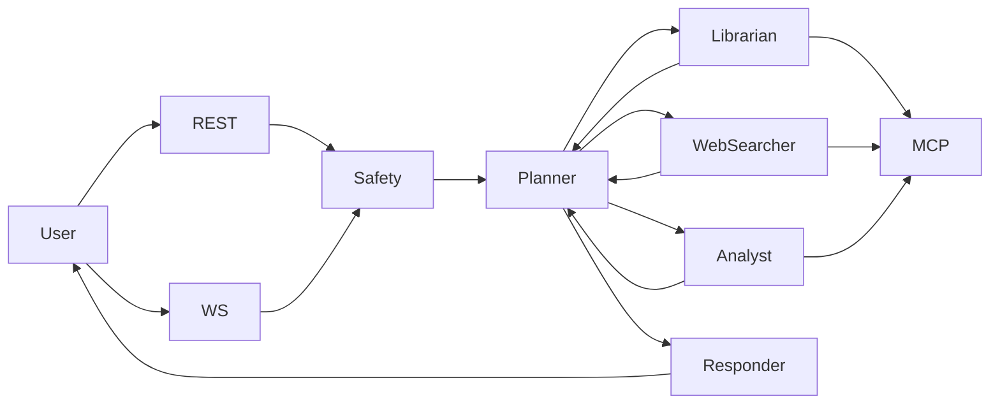

# OpenFund-AI

Live multi-agent investment research system over MCP tools and FastAPI.

## Project goals

Users need investment-research answers tailored to their expertise. OpenFund-AI accepts a natural-language query, coordinates multiple research steps, and returns a single, profile-appropriate response with safety and compliance enforced.

**Target users**

- **Beginner** — Conclusion-first answers, analogies, minimal jargon, clear risk warnings.
- **Long-term holder** — Industry trends, drawdown behavior, horizon-based view.
- **Analyst** — Full calculation workflow, raw metrics, model assumptions, confidence intervals.

**In scope**

- Single conversational interface: one query → one final response per conversation.
- Three user profiles with distinct response formatting.
- Safety checks on input (validation, guardrails, PII handling).
- Conversation continuity (create or continue by conversation ID).
- Orchestrated research (specialists used as needed; one or more rounds).
- Compliance check on output before delivery.
- Time-bounded processing with explicit timeout behavior.

See [docs/prd.md](docs/prd.md) for full requirements and acceptance criteria.

## Implementation architecture

**Layers:** User interaction (REST + WebSocket) → Safety → Orchestration (Planner) → Research execution (Librarian, WebSearcher, Analyst) → Tool/data (MCP) → Output review (Responder).

**Hub-and-spoke:** The Planner is the sole orchestrator. It decides which agents to call (Librarian, WebSearcher, Analyst), decomposes the user query into agent-specific sub-queries, and sends REQUESTs. Specialists reply only to the Planner. When information is sufficient, the Planner sends consolidated data to the Responder, which formats the final answer and signals conversation complete.

**Data flow:** Agents communicate via FIPA-ACL messages over an in-memory message bus. All external data (vector DB, graph, market, analyst API, SQL, files) is accessed only through MCP tools—no direct backend access from orchestration logic. Specialists use an LLM (with prompts and tool descriptions) to choose which MCP tools to call and with what parameters.



See [docs/backend.md](docs/backend.md) for API contracts, data models, and configuration.

## Highlights

- **Multi-agent pipeline** — Planner (orchestrator), Librarian, WebSearcher, Analyst, and Responder; each specialist has a defined role and tool pool.
- **LLM-driven orchestration** — Planner decomposes queries and decides sufficiency; specialists use an LLM to select MCP tools and parameters.
- **MCP-only external data** — Vector (Milvus), knowledge graph (Neo4j), market (Alpha Vantage / Finnhub), analyst (indicators), SQL (PostgreSQL), and file tools.
- **Profile-based responses** — Answers formatted for beginner, long_term, or analyst; OutputRail handles compliance before delivery.
- **Safety and validation** — Input validation, guardrails, and PII masking before processing.
- **Optional backends** — PostgreSQL, Neo4j, Milvus; start via `run.sh` or run API without them.
- **Data manager CLI** — Collect and distribute fund data; populate backends; run SQL over loaded data.
- **REST + WebSocket** — POST /chat and /ws with flow events; auth via POST /register and POST /login.

## Quick start

**Prerequisites:** Python 3. Run all commands from the project root.

```bash
./scripts/run.sh
```

On first run this creates `.env` from `.env.example` (edit `.env` and set `LLM_API_KEY`, then re-run). The script starts local backends (PostgreSQL, Neo4j, Milvus) when configured in `.env`, seeds baseline data, loads `datasets/combined_funds.json`, starts the live API, and launches an **interactive chat** in the terminal. Use `--no-chat` to start the API only (no chat client). For a **setup checklist** (tools callable, LLM functioning) and troubleshooting, see [docs/demo.md](docs/demo.md).

## Commands reference

### One-command run

```bash
./scripts/run.sh
./scripts/run.sh --help
```

**Options**

| Option | Description |
|--------|-------------|
| `--port <n>` | API port (default 8000) |
| `--no-backends` | Skip starting Postgres/Neo4j/Milvus |
| `--no-seed` | Skip `python -m data_manager populate` |
| `--funds <mode>` | `existing` \| `fresh-symbols` \| `fresh-all` \| `skip` |
| `--install-deps` | Install Python extras [backends,llm] |
| `--wait <secs>` | Wait after backend start before seed (default 8) |
| `--no-chat` | Start API only; do not launch interactive chat client |

Examples:

```bash
./scripts/run.sh --port 8010
./scripts/run.sh --no-backends
./scripts/run.sh --no-seed
./scripts/run.sh --funds existing
./scripts/run.sh --funds fresh-symbols
./scripts/run.sh --funds fresh-all
./scripts/run.sh --funds skip
./scripts/run.sh --install-deps
./scripts/run.sh --no-chat   # API only, no interactive chat
```

### Direct API run

If you prefer to run without the helper script (e.g. no backends, no seed):

```bash
python main.py --serve --port 8000
```

Use `python3` if `python` is not Python 3.

### Data CLI

```bash
python -m data_manager --help
python -m data_manager populate
python -m data_manager distribute-funds --file datasets/combined_funds.json --load-mode existing
python -m data_manager distribute-funds --file datasets/combined_funds.json --load-mode fresh --fresh-scope symbols
python -m data_manager distribute-funds --file datasets/combined_funds.json --load-mode fresh --fresh-scope all
python -m data_manager sql "SELECT * FROM fund_info LIMIT 5"
```

The `sql` command requires PostgreSQL configured in `.env` and loaded data (e.g. after `./scripts/run.sh` or `distribute-funds`).

## API usage

- **Auth:** Register with a unique username via `POST /register`; login via `POST /login`. Username duplicates are rejected.
- **Chat:** Send a query with `POST /chat` (body: `query`, `user_profile` (beginner \| long_term \| analyst), optional `user_id`, `conversation_id`) or over WebSocket `/ws` with the same fields. Response includes `conversation_id`, `status`, `response`, and optional `flow` (step list for UI).

Full contracts, request/response shapes, and timeout behavior: [docs/backend.md](docs/backend.md).

## Notes

- **LLM_API_KEY** is required for live planner/specialist decomposition. Install optional LLM deps: `pip install -e ".[llm]"`.
- Requires **Python 3**. Run all commands from **project root**.
- System is **live-only** (no demo stub).

**Further reading:** [docs/prd.md](docs/prd.md) (goals, requirements), [docs/backend.md](docs/backend.md) (API, config), [docs/progress.md](docs/progress.md) (work breakdown), [docs/project-status.md](docs/project-status.md) (capability status).
