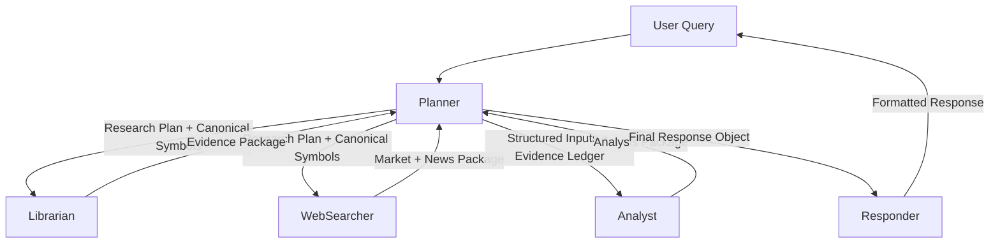

# Handoff Contracts

## Diagram


## JSON Contracts

### 1) Planner -> Specialists (REQUEST)
```json
{
  "conversation_id": "string",
  "request_id": "string",
  "query": "string",
  "query_type": "price|facts|news|compare|portfolio|thesis",
  "symbols": ["string"],
  "asset_class": "equity|etf|index|fund|crypto|other",
  "freshness_requirements": {
    "price_max_age_minutes": 15,
    "fundamentals_max_age_days": 90,
    "news_lookback_days": 7
  },
  "evidence_requirements": {
    "min_sources": 2,
    "require_citations": true
  },
  "user_profile": "beginner|long_term|analyst"
}
```

### 2) Librarian -> Planner (INFORM)
```json
{
  "conversation_id": "string",
  "request_id": "string",
  "agent": "librarian",
  "documents": [
    {
      "doc_id": "string",
      "title": "string",
      "snippet": "string",
      "source": "internal_kb|uploaded_doc",
      "timestamp": "YYYY-MM-DD"
    }
  ],
  "graph": {
    "nodes": [{"id": "string", "label": "string"}],
    "edges": [{"source": "string", "target": "string", "relation": "string"}]
  },
  "key_facts": [
    {
      "fact": "string",
      "confidence": 0.0,
      "evidence_doc_ids": ["string"]
    }
  ],
  "summary": "string",
  "confidence": 0.0,
  "errors": []
}
```

### 3) WebSearcher -> Planner (INFORM)
```json
{
  "conversation_id": "string",
  "request_id": "string",
  "agent": "websearcher",
  "market_data": {
    "symbol": "string",
    "price": 0.0,
    "price_timestamp": "YYYY-MM-DDTHH:MM:SSZ",
    "price_source": "stooq|yahoo|alpha_vantage|finnhub",
    "fundamentals": {
      "pe": 0.0,
      "eps": 0.0,
      "market_cap": 0.0
    },
    "fundamentals_timestamp": "YYYY-MM-DD",
    "source_conflicts": [
      {
        "field": "price",
        "values": [{"source": "stooq", "value": 0.0}],
        "chosen_source": "stooq",
        "reason": "string"
      }
    ]
  },
  "news_items": [
    {
      "title": "string",
      "summary": "string",
      "source": "string",
      "url": "string",
      "published_date": "YYYY-MM-DD"
    }
  ],
  "citations": {
    "NEWS1": "https://example.com/article"
  },
  "freshness": {
    "price_is_fresh": true,
    "fundamentals_is_fresh": true
  },
  "summary": "string",
  "errors": []
}
```

### 4) Planner -> Analyst (REQUEST)
```json
{
  "conversation_id": "string",
  "request_id": "string",
  "agent": "analyst",
  "symbols": ["string"],
  "evidence_ledger": {
    "facts": [
      {
        "fact": "string",
        "source": "librarian|websearcher",
        "confidence": 0.0,
        "timestamp": "YYYY-MM-DD"
      }
    ],
    "market_snapshot": {
      "symbol": "string",
      "price": 0.0,
      "price_timestamp": "YYYY-MM-DDTHH:MM:SSZ"
    }
  },
  "constraints": {
    "recommendation_allowed": false,
    "confidence_threshold": 0.75
  }
}
```

### 5) Analyst -> Planner (INFORM)
```json
{
  "conversation_id": "string",
  "request_id": "string",
  "agent": "analyst",
  "confidence": 0.0,
  "key_metrics": {
    "rsi": 0.0,
    "volatility": 0.0,
    "drawdown": 0.0
  },
  "scenario_outcomes": [
    {
      "scenario": "bull|base|bear",
      "expected_return": 0.0,
      "probability": 0.0
    }
  ],
  "risk_factors": ["string"],
  "limitations": ["string"],
  "summary": "string"
}
```

### 6) Planner -> Responder (INFORM)
```json
{
  "conversation_id": "string",
  "final_response_object": {
    "query": "string",
    "symbols": ["string"],
    "summary": "string",
    "evidence": [
      {
        "fact": "string",
        "source": "librarian|websearcher",
        "timestamp": "YYYY-MM-DD",
        "citation_id": "NEWS1"
      }
    ],
    "analysis": {
      "confidence": 0.0,
      "scenario_outcomes": []
    },
    "recommendation": {
      "allowed": false,
      "action": "buy|sell|hold|none",
      "reason": "string",
      "horizon": "short|mid|long"
    },
    "risks": ["string"],
    "disclaimer_required": true
  },
  "user_profile": "beginner|long_term|analyst",
  "insufficient": false
}
```

### 7) Responder -> API/User (INFORM)
```json
{
  "conversation_id": "string",
  "final_response": "string"
}
```
