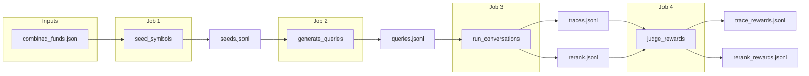

# Plan A: Response Reranking (DAG + Schemas)

Single source of truth for the **pipeline DAG** and **all record schemas**. For what data we collect and where, see [data_collection.md](data_collection.md). For how to run the pipeline, see [execution.md](execution.md).

---

## Data flow



---

## DAG (jobs, inputs, outputs)

All paths under `datasets/synth/` unless noted. IDs (e.g. `query_id`, `rerank_id`) are UUIDs or `conversation_id` + run identifier where one record per conversation is required.

### Job 1: `seed_symbols`

| | |
|--|--|
| **Input** | `datasets/combined_funds.json` |
| **Output** | `datasets/synth/seeds.jsonl` |
| **Record type** | SeedRecord |

Extracts symbol/name/kind from the combined funds file into one JSONL record per symbol.

### Job 2: `generate_queries`

| | |
|--|--|
| **Inputs** | `datasets/synth/seeds.jsonl`, taxonomy config, LLM client |
| **Output** | `datasets/synth/queries.jsonl` |
| **Record type** | QueryRecord |

LLM-driven query generation using seeds and a fixed taxonomy (e.g. fund_compare, risk_profile, drawdown, valuation, macro_impact). One QueryRecord per generated query.

### Job 3: `run_conversations`

| | |
|--|--|
| **Inputs** | `datasets/synth/queries.jsonl`, LLM client, MCP client (real tools), system config |
| **Outputs** | `datasets/synth/traces.jsonl`, `datasets/synth/rerank.jsonl` |
| **Record types** | TraceRecord, RerankRecord |

For each query, runs the full flow (planner → tools → agents → Responder). Writes **one TraceRecord** per conversation (full planner/tool trace). Writes **one RerankRecord** per conversation when reranking is used (K candidates + selected + final). When RL is disabled, rerank.jsonl may still be written with a single candidate per row.

### Job 4: `judge_rewards`

| | |
|--|--|
| **Inputs** | `datasets/synth/traces.jsonl`, `datasets/synth/rerank.jsonl`, judge LLM |
| **Outputs** | `datasets/synth/trace_rewards.jsonl`, `datasets/synth/rerank_rewards.jsonl` |
| **Record type** | RewardRecord |

Reads traces and rerank records. For **trace_rewards**: scores the final response per trace (one RewardRecord per trace; `source_id` = trace_id, `response_id` optional). For **rerank_rewards**: scores each candidate (or only the selected response) per RerankRecord using the judge LLM rubric; `source_id` = rerank_id, `response_id` set per candidate. Reward is numeric 0–1; rubric sub-scores: helpfulness, correctness, completeness, compliance.

---

## Schemas

Each record type is defined once. Use these for JSONL read/write and validation.

### SeedRecord

One per symbol from the seed source.

```json
{
  "symbol": "string",
  "name": "string",
  "kind": "fund|equity",
  "source": "combined_funds.json"
}
```

| Field | Description |
|-------|-------------|
| `symbol` | Ticker or fund identifier. |
| `name` | Display name. |
| `kind` | `fund` or `equity`. |
| `source` | Origin file (e.g. `combined_funds.json`). |

---

### QueryRecord

One per generated query. `query_id` links to downstream traces/rerank (e.g. UUID).

```json
{
  "query_id": "string",
  "query": "string",
  "user_profile": "beginner|long_term|analyst",
  "category": "fund_compare|risk_profile|drawdown|valuation|macro_impact",
  "seed_symbols": ["string"],
  "created_at": "ISO8601"
}
```

| Field | Description |
|-------|-------------|
| `query_id` | Unique ID; links to TraceRecord and RerankRecord. |
| `query` | Natural-language query text. |
| `user_profile` | beginner, long_term, or analyst. |
| `category` | Taxonomy category. |
| `seed_symbols` | Symbols used to generate this query. |
| `created_at` | ISO8601 timestamp. |

---

### TraceRecord

One per conversation. Full planner/tool trace for debugging or planner/tool optimization (e.g. Plan B). `trace_id` = UUID or conversation_id + run id.

```json
{
  "trace_id": "string",
  "query_id": "string",
  "conversation_id": "string",
  "user_profile": "beginner|long_term|analyst",
  "query": "string",
  "planner_steps": [
    { "agent": "librarian|websearcher|analyst", "query": "string" }
  ],
  "tool_calls": [
    {
      "tool": "string",
      "payload": {},
      "result_summary": { "keys": ["string"], "error": "string|null" },
      "duration_ms": "number"
    }
  ],
  "agent_outputs": {
    "librarian": { "summary": "string", "data": {} },
    "websearcher": { "summary": "string", "data": {} },
    "analyst": { "summary": "string", "data": {} }
  },
  "final_response": "string",
  "compliance_passed": "boolean",
  "latency_ms": "number",
  "created_at": "ISO8601"
}
```

| Field | Description |
|-------|-------------|
| `trace_id` | Unique ID; referenced by RewardRecord when source = trace. |
| `query_id` | Links to queries.jsonl. |
| `conversation_id` | Conversation UUID from the run. |
| `planner_steps` | Decomposed steps (agent + query). |
| `tool_calls` | Tool name, payload, result summary, duration. |
| `agent_outputs` | Per-agent summary and data. |
| `final_response` | Single final response text. |
| `compliance_passed` | OutputRail compliance result. |
| `latency_ms` | End-to-end latency. |

---

### RerankRecord

One per conversation when reranking is used. Holds K candidates, the selected response, and the final formatted response. When RL is disabled, `candidates` may have length 1. `rerank_id` = UUID or conversation_id + run id.

```json
{
  "rerank_id": "string",
  "query_id": "string",
  "conversation_id": "string",
  "user_profile": "beginner|long_term|analyst",
  "query": "string",
  "candidates": [
    {
      "response_id": "string",
      "text": "string",
      "compliance_passed": "boolean"
    }
  ],
  "selected_response_id": "string",
  "final_response": "string",
  "created_at": "ISO8601"
}
```

| Field | Description |
|-------|-------------|
| `rerank_id` | Unique ID; referenced by RewardRecord when source = rerank. |
| `query_id` | Links to queries.jsonl. |
| `candidates` | K candidate responses with response_id, text, compliance_passed. |
| `selected_response_id` | response_id of the chosen candidate. |
| `final_response` | Formatted final response returned to the user. |

---

### RewardRecord

One per scored item (trace or rerank candidate). Used for training the reward model. `reward_id` = UUID; `source_id` = trace_id or rerank_id; `response_id` = null for trace-level reward or the candidate’s response_id for rerank.

```json
{
  "reward_id": "string",
  "source_id": "string",
  "query_id": "string",
  "response_id": "string|null",
  "scores": {
    "helpfulness": "number",
    "correctness": "number",
    "completeness": "number",
    "compliance": "number"
  },
  "reward": "number",
  "judge_model": "string",
  "created_at": "ISO8601"
}
```

| Field | Description |
|-------|-------------|
| `source_id` | trace_id (for trace_rewards.jsonl) or rerank_id (for rerank_rewards.jsonl). |
| `response_id` | Set for rerank candidate rewards; null for trace-level reward. |
| `scores` | Rubric sub-scores (0–1 or equivalent). |
| `reward` | Aggregate reward (0–1). |
| `judge_model` | Judge LLM identifier. |

---

## Code layout (minimal)

| Path | Purpose |
|------|---------|
| `pipeline/__init__.py` | Package init. |
| `pipeline/schemas.py` | Dataclasses + JSONL read/write helpers for all record types. |
| `pipeline/seeds.py` | Read `combined_funds.json`, emit SeedRecord JSONL. |
| `pipeline/query_gen.py` | LLM-driven query generation + taxonomy. |
| `pipeline/runner.py` | Orchestrate agent threads, run queries, capture TraceRecord and RerankRecord. |
| `pipeline/tracing_mcp.py` | MCPClient wrapper to record tool calls and results. |
| `pipeline/judge.py` | Judge LLM prompt + scoring logic → RewardRecord. |
| `pipeline/cli.py` | Subcommands: `gen-seeds`, `gen-queries`, `run`, `judge`. |
| `scripts/run_pipeline.py` | Thin entrypoint that calls `pipeline.cli`. |

Reuse existing agents, MCP client, and LLM client; pipeline only orchestrates and writes JSONL.

---

## Test plan

1. **gen-seeds:** Builds valid SeedRecord JSONL from `combined_funds.json`.
2. **gen-queries:** Produces valid QueryRecord JSONL with taxonomy coverage.
3. **run:** Produces TraceRecord and RerankRecord with required fields and tool calls logged.
4. **judge:** Emits RewardRecord with 0–1 reward and rubric sub-scores.
5. Schema validation for each JSONL file (required fields, types).

---

## Assumptions

- Real MCP tools are configured (API keys, DBs) for `run_conversations`.
- LLM API is available for query generation and judge scoring.
- Data is stored as JSONL under `datasets/synth/` for simplicity.
