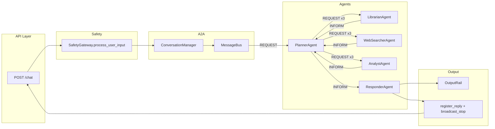

# Use-case trace: beginner user — one request flow

This document traces **all intermediate function calls and expected returns** when a beginner user sends a single `POST /chat` request. Use it to see how a user query flows through the system, for debugging and onboarding. Success path only; timeout and error paths are noted briefly.

See [backend.md](backend.md) for API contracts and [file-structure.md](file-structure.md) for per-function details.

---

## 1. Input

**Request:** `POST /chat`

**Body:**
```json
{
  "query": "Is fund X safe for someone new to investing?",
  "user_profile": "beginner",
  "user_id": "user_123"
}
```

- No `conversation_id` → new conversation is created.
- No `path` → no file path is passed to the librarian (planner still sends the query string as content; librarian may treat it as path for file_tool when no other keys are present, leading to an error from read_file in this example).

---

## 2. High-level flow



**Logical order:** API validates and runs safety → creates conversation → sends REQUEST to planner → planner sends the initial planner round REQUESTs to librarian, websearcher, analyst → each agent runs and sends INFORM to planner → planner runs the planner sufficiency check and either starts refined planner round(s) or sends INFORM to responder → responder formats via OutputRail (beginner), checks compliance, registers reply, broadcasts STOP → API unblocks and returns 200.

**Threading:** The planner, librarian, websearcher, analyst, and responder each run in their own thread. The trace below is in logical order; the actual interleaving of steps 8–11 (the three specialists) depends on the scheduler.

---

## 3. Step-by-step function trace

Each row gives **caller**, **function** (with module path), **arguments** (key ones), and **expected return** (type and representative value or shape).

| Step | Caller | Function | Arguments (key) | Expected return |
|------|--------|----------|-----------------|------------------|
| 1 | REST ([api/rest.py](api/rest.py)) | `ChatRequest` (Pydantic model) | body dict from request | Validated `body.query`, `body.user_profile` = `"beginner"`, `body.user_id` = `"user_123"`. Invalid body raises `RequestValidationError` (HTTP 422). |
| 2 | REST | `SafetyGateway.process_user_input(query)` | `raw_input` = `body.query` | `ProcessedInput(text=..., raw_length=..., masked=bool)` or raises `SafetyError` → HTTP 400. |
| 2a | SafetyGateway ([safety/safety_gateway.py](safety/safety_gateway.py)) | `validate_input(text)` | `text` = query | `ValidationResult(valid=True)`. If empty or too long or invalid chars: `valid=False`, `reason` set. |
| 2b | SafetyGateway | `check_guardrails(text)` | same text | `GuardrailResult(allowed=True)`. If blocked phrase present: `allowed=False`, `reason` set. |
| 2c | SafetyGateway | `mask_pii(text)` | same text | `str` (PII such as phone, email, SSN-like replaced with placeholders). |
| 3 | REST | `ConversationManager.create_conversation(user_id, query)` ([a2a/conversation_manager.py](a2a/conversation_manager.py)) | `"user_123"`, processed query text | `conversation_id` (UUID str). |
| 3a | ConversationManager | `_save_user(user_id)` | — | `None`. Side effect: writes `memory/user_123/conversations.json` (or `MEMORY_STORE_PATH`). |
| 4 | REST | `manager.get_conversation(conversation_id)` | `cid` | `ConversationState`: `id`, `user_id`, `initial_query`, `messages=[]`, `status="active"`, `final_response=None`, `completion_event` (threading.Event). |
| 5 | REST | `bus.send(ACLMessage(...))` | `performative=REQUEST`, `sender="api"`, `receiver="planner"`, `content={ "query", "conversation_id", "user_profile", ... }` (optional: `user_memory`, `path`) | `None`. Message is queued for planner. |
| 6 | PlannerAgent ([agents/planner_agent.py](agents/planner_agent.py)) | `bus.receive("planner")` (in run loop) | — | `ACLMessage` (REQUEST from api). |
| 7 | PlannerAgent | `handle_message(message)` | `message` | `None`. Sends the initial planner round REQUESTs to librarian, websearcher, analyst. |
| 7a | PlannerAgent | `decompose_task(query)` | `query` from content | `list[TaskStep]`: e.g. `[ TaskStep(agent="librarian", action="read_file", params={"query": query}), TaskStep(agent="websearcher", action="fetch_market", params={"query": query}), TaskStep(agent="analyst", action="analyze", params={"query": query}) ]`. If LLM client set, may use `llm_client.decompose_to_steps(query)`; else fixed three steps. |
| 7b | PlannerAgent | `create_research_request(query, step, None)` | `query`, each `TaskStep` | `ACLMessage(performative=REQUEST, sender="planner", receiver=step.agent, content={"query", "action", **step.params})`. Called once per step. |
| 7c | PlannerAgent | `bus.send(req)` | each request message | `None`. Three messages queued for librarian, websearcher, analyst. |
| 8 | LibrarianAgent ([agents/librarian_agent.py](agents/librarian_agent.py)) | `bus.receive("librarian")` | — | `ACLMessage` (REQUEST from planner). |
| 9 | LibrarianAgent | `handle_message(message)` | `message` | `None`. Builds reply from MCP calls and sends INFORM to planner. |
| 9a | LibrarianAgent | `mcp_client.call_tool("file_tool.read_file", {"path": path})` | `path` = content.get("path") or content.get("query") (here, the query string) | `dict`: e.g. `{"error": "..."}` when path is not a real file, or `{"content": "...", "path": "..."}` when file exists. MCP dispatch: `MCPServer.dispatch("file_tool.read_file", payload)` → handler return or `{"error": "..."}`. |
| 9b | LibrarianAgent | Build `reply_content`; `bus.send(ACLMessage(INFORM, sender="librarian", receiver="planner", content=reply_content, ...))` | — | `None`. When only file result: `reply_content` = file dict or error; when multiple tools, `combine_results` + optional file/sql. |
| 10 | WebSearcherAgent ([agents/websearch_agent.py](agents/websearch_agent.py)) | `bus.receive("websearcher")` → `handle_message(message)` | — | — |
| 10a | WebSearcherAgent | `fetch_market_data(fund)` → `mcp_client.call_tool("market_tool.get_fundamentals", {"ticker": fund, "symbol": fund})` | `fund` from content (query or "AAPL") | `dict` with market data and `timestamp`, or `{"error": "...", "timestamp": ""}`. |
| 10b | WebSearcherAgent | `fetch_sentiment(...)` → `call_tool("market_tool.get_news", {"symbol": ..., "limit": 3})` | — | `dict` (with timestamp or error). |
| 10c | WebSearcherAgent | `fetch_regulatory(...)` → `call_tool("market_tool.get_global_news", {...})` | — | `dict` (with timestamp or error). |
| 10d | WebSearcherAgent | `bus.send(ACLMessage(INFORM, content={ market_data, sentiment, regulatory }))` | — | `None`. |
| 11 | AnalystAgent ([agents/analyst_agent.py](agents/analyst_agent.py)) | `bus.receive("analyst")` → `handle_message(message)` | — | — |
| 11a | AnalystAgent | `analyze(structured_data, market_data)` | from content (here may be empty dicts) | `dict` e.g. `{"confidence": 0.6, "summary": "Stub analysis", "distribution": {}}`. May call `mcp_client.call_tool("analyst_tool.get_indicators", ...)` and merge. |
| 11b | AnalystAgent | (inside analyze, if mcp_client set) `mcp_client.call_tool("analyst_tool.get_indicators", {...})` | — | `dict` or `{"error": "..."}`. |
| 11c | AnalystAgent | `bus.send(ACLMessage(INFORM, content={ "analysis": result, "conversation_id" }))` | — | `None`. |
| 12 | PlannerAgent | `bus.receive("planner")` (three times: INFORM from librarian, websearcher, analyst) | — | Each returns one INFORM message. |
| 12a | PlannerAgent | `handle_message` for each INFORM: `_collected[cid][sender] = content`, `_round_pending[cid].discard(sender)` | — | — |
| 12b | PlannerAgent | When `_round_pending[cid]` empty: `_check_sufficiency(user_query, aggregated)` | original query + aggregated specialist output | `bool`. If `False` and round cap not reached, planner builds refined steps and dispatches another round. |
| 12c | PlannerAgent | When sufficient (or refinement exhausted): `_format_final(collected)` then `bus.send(ACLMessage(INFORM, receiver="responder", content={ final_response, conversation_id, user_profile, insufficient? }))` | `collected` = map agent name → INFORM content | `None`. |
| 13 | ResponderAgent ([agents/responder_agent.py](agents/responder_agent.py)) | `bus.receive("responder")` → `handle_message(message)` | — | — |
| 13a | ResponderAgent | `output_rail.format_for_user(final_response, "beginner")` ([output/output_rail.py](output/output_rail.py)) | `text` = final_response str, `user_profile` = `"beginner"` | `str`: `text.strip() + "\n\nThis is not investment advice."` |
| 13b | ResponderAgent | `output_rail.check_compliance(draft)` | `draft` = formatted text | `ComplianceResult(passed=True)` or `passed=False`, `reason` set if blocked phrase found. |
| 13c | ResponderAgent | If not passed: append disclaimer to draft | — | — |
| 13d | ResponderAgent | `conversation_manager.register_reply(conversation_id, reply_msg)` | — | `None`. |
| 13e | ConversationManager | `register_reply`: append message to `state.messages`, set `state.final_response`, `state.status = "complete"`, `state.completion_event.set()`, `_save_user(user_id)` | — | `None`. API thread blocking on `completion_event.wait()` is unblocked. |
| 13f | ResponderAgent | `conversation_manager.broadcast_stop(conversation_id)` | — | `None`. |
| 13g | ConversationManager | `broadcast_stop`: `bus.broadcast(ACLMessage(performative=STOP, receiver="*", content={ conversation_id }))` | — | `None`. All agent threads receive STOP and exit their run loop. |
| 14 | REST | `state.completion_event.wait(timeout)` | `timeout` from config | Returns when signaled (True). If timeout: returns without signal → API returns 408. |
| 15 | REST | Build `JSONResponse(status_code=200, content={ conversation_id, status, response, flow })` | `state.status`, `state.final_response`, `manager.get_flow_events(conversation_id)` | HTTP 200 with JSON body. |

---

## 4. Beginner-specific behavior

- **OutputRail.format_for_user(text, "beginner"):** For `user_profile == "beginner"`, the implementation appends `"\n\nThis is not investment advice."` to the response text. See [output/output_rail.py](output/output_rail.py) (lines 65–67).
- **ResponderAgent** reads `user_profile` from the planner's INFORM content (already `"beginner"`), passes it to `format_for_user`, runs `check_compliance`, stores final response, and broadcasts STOP. The Phase 2 methods `evaluate_confidence`, `should_terminate`, `format_response`, and `request_refinement` remain stubs and are **not** part of the active flow.

---

## 5. Example final HTTP response

**Status:** 200 OK

**Body (example):**
```json
{
  "conversation_id": "550e8400-e29b-41d4-a716-446655440000",
  "status": "complete",
  "response": "Librarian: data retrieved. WebSearcher: market and sentiment data retrieved. Analyst: analysis complete.\n\nThis is not investment advice.",
  "flow": [
    {"step": "user_created", "message": "New conversation started. (welcome, user user_123) You can ask your question below."},
    {"step": "request_sent", "message": "Query received. Sent to Planner; you will see decomposition and agent steps as they run."}
  ]
}
```

Exact `response` text depends on what the librarian, websearcher, and analyst return in this run (e.g. if librarian gets a real file, the file content may appear in the concatenated summary; if file_tool returns an error, librarian may still send a reply with that error or a fallback string). The trailing disclaimer is always added for the beginner profile.

---

## 6. MCP dispatch

Each `mcp_client.call_tool(tool_name, payload)` is implemented as `MCPServer.dispatch(tool_name, payload)`: the server looks up the registered handler for that tool name, invokes it with the payload, and returns the handler's return value. If the tool is unknown or the handler raises, the server returns `{"error": "..."}`. The trace above does not repeat each MCP tool's internal logic; see [mcp/mcp_server.py](mcp/mcp_server.py) and [mcp/tools/](mcp/tools/) for tool implementations.

---

## 7. Conventions and references

- **Threading:** Planner, librarian, websearcher, analyst, and responder each run in a separate thread (started in `create_app` or `main._run_e2e_once`). The sequence in §3 is the logical order of execution; steps 8–11 (the three specialists) can run in any order or in parallel depending on the scheduler.
- **Code references:** For per-function contracts and file layout, see [file-structure.md](file-structure.md). For API and architecture, see [backend.md](backend.md). For user-flow and audience differences, see [user-flow.md](user-flow.md).

**Error paths (not traced here):** On safety failure the API returns 400; on schema/body validation failures (for example invalid `user_profile`) FastAPI returns 422. On unknown `conversation_id` (GET or POST continue) the API returns 404. On timeout, `completion_event.wait(timeout)` returns without being set and the API returns 408 with `response: null`. WebSocket `/ws` follows the same logical flow after accept and receiving one JSON message.
