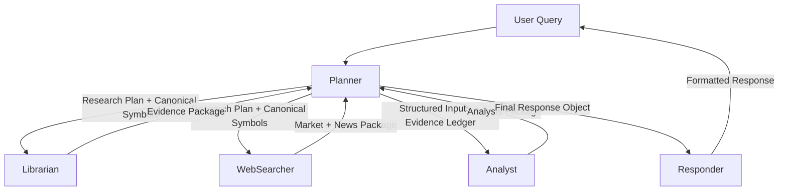

# Handoff Contracts

Canonical **wire shapes** for agent-to-agent payloads. Implementation and tests in `agents/` and `tests/test_*_contract*.py` are the source of truth; this document tracks them.

## ACL envelope vs `content`

`ACLMessage` ([`a2a/acl_message.py`](../../../a2a/acl_message.py)) carries **`conversation_id`**, **`sender`**, **`receiver`**, **`performative`**, and **`content`**. Samples below focus on **`content`**; **`conversation_id`** is on the message and may also appear inside `content` for logging or clients. There is no separate `request_id` in the current Python implementation unless added by callers.

## Doc vs implementation matrix

| Handoff | Implementation |
|---------|------------------|
| Planner → specialist REQUEST | `agents/planner_orchestration.py` `create_research_request`; nested **`research_plan`** from `PlannerContextMixin._build_research_plan` |
| Librarian → Planner INFORM | `agents/librarian_orchestration.py` `_augment_librarian_contract` + `_send_inform` |
| WebSearcher → Planner INFORM | `agents/websearch_pipeline.py` `_augment_websearch_contract` + merged pipeline dict |
| Planner → Responder INFORM | `agents/planner_context.py` `_build_final_response_object`; full INFORM in `planner_orchestration` |

## Diagram



## JSON contracts

### 1) Planner → Specialists (REQUEST `content`)

The planner sends a **REQUEST** whose `content` includes:

- **`query`**: Decomposed query for this step (from `TaskStep.params`, defaulting to the user query).
- **`research_plan`**: Canonical envelope (see below).
- Optional **`symbol_resolution`**: Full resolver payload when available (`schema_version`, `status`, `listings`, `by_tool`, etc.).
- When resolution status is **`resolved`**, optional mirrors: **`resolution_listings`**, **`resolution_symbol_type`**, **`resolution_canonical_name`**.
- Additional keys from **`TaskStep.params`** are merged into `content` (tool hints, etc.).

**`research_plan`** (nested object):

```json
{
  "query_type": "price|facts|news|compare|portfolio|thesis",
  "symbols": ["NVDA"],
  "freshness_requirements": {
    "price_max_age_minutes": 15,
    "fundamentals_max_age_days": 90,
    "news_lookback_days": 7
  },
  "evidence_requirements": {
    "min_sources": 2,
    "require_citations": true
  },
  "user_profile": "beginner|long_term|analyst"
}
```

**Logical view** (older flat diagram): `query_type`, `symbols`, freshness, evidence, and `user_profile` appear **inside `research_plan`**, not only at the top level of `content`.

### 2) Librarian → Planner (INFORM `content`)

Raw retrieval outputs are normalized before INFORM. After augmentation, expect at least:

- **`agent`**: `"librarian"`.
- **`documents`**: List of `{doc_id, title, snippet, source, timestamp}`.
- **`graph`**: `{nodes, edges}` when present.
- **`key_facts`**: List of `{fact, confidence, evidence_doc_ids}` derived from documents.
- **`evidence`**: Map of `doc_id` → snippet text for traceability.
- **`citations`**: List of doc ids cited.
- **`summary`**: LLM or fallback summary string.
- **`confidence`**: Float in `[0, 1]`.
- **`errors`**: List of strings (normalized from heterogeneous error shapes).

### 3) WebSearcher → Planner (INFORM `content`)

**Wire payload** (conceptual “market + news package”) uses implementation keys:

- **`normalized_fund`**: Rows per symbol (price, timestamps, sources, merged fundamentals, optional `conflict_resolution`).
- **`market_data`**, **`sentiment`**, **`regulatory`**: Grouped blobs from parallel fetches (when present).
- **`citations`**: Map of citation ids → URLs.
- **`news_items`**, **`news_digest`**: Normalized news lists when present.
- **`freshness`**: Added by **`_augment_websearch_contract`**: `{price_is_fresh, fundamentals_is_fresh}` from **source** timestamps on `normalized_fund` rows (`price_timestamp`, `fundamentals_timestamp`), not from local processing time.
- **`source_conflicts`**: List of per-symbol arbitration summaries from `conflict_resolution` on rows (field name in wire output; related to logical “source_conflicts” in product docs).

**Logical view** (single-symbol summary): A consumer can derive a view similar to “market_data + news_items” from `normalized_fund` and `news_items`, but integrations should rely on the **wire keys** above.

### 4) Planner → Analyst (REQUEST `content`)

Includes decomposed **`query`**, **`research_plan`**, optional **`symbol_resolution`**, plus planner-built **`evidence_ledger`** and **`constraints`** when the planner dispatches the analyst step (see `planner_orchestration` / decomposition). Shape aligns with analyst prompts and `TaskStep.params`.

### 5) Analyst → Planner (INFORM `content`)

Structured analysis: **`confidence`**, **`key_metrics`**, **`scenario_outcomes`**, **`risk_factors`**, **`limitations`**, **`summary`**, and optional nested **`analysis`** depending on code path. See `agents/analyst_*.py`.

### 6) Planner → Responder (INFORM `content`)

Planner sends (among other keys) **`final_response`** (string), **`final_response_object`**, **`evidence_ledger`**, **`recommendation`** (gate result), **`user_profile`**, **`insufficient`**, **`partial_insufficient`**.

**`final_response_object`** (implemented in `_build_final_response_object`):

```json
{
  "query": "string",
  "symbols": ["string"],
  "summary": "string",
  "evidence": [
    {
      "fact": "string",
      "source": "librarian|websearcher",
      "timestamp": "",
      "confidence": null
    }
  ],
  "analysis": {
    "confidence": 0.0,
    "scenario_outcomes": []
  },
  "recommendation": {
    "allowed": false,
    "action": "hold|none",
    "reason": "reason_code",
    "horizon": "mid|"
  },
  "risks": ["string"],
  "limitations": ["string"],
  "disclaimer_required": true
}
```

**Responder rendering** ([`agents/responder_agent.py`](../../../agents/responder_agent.py)): Uses `summary`, `evidence` (optional `citation_id` when present on facts), `risks`, `limitations`, and gated **`recommendation`** when `allowed` is true.

### 7) Responder → API/User

**`final_response`**: Single formatted string after compliance / profile formatting; see API contracts in [backend.md](../02_planning/backend.md).
