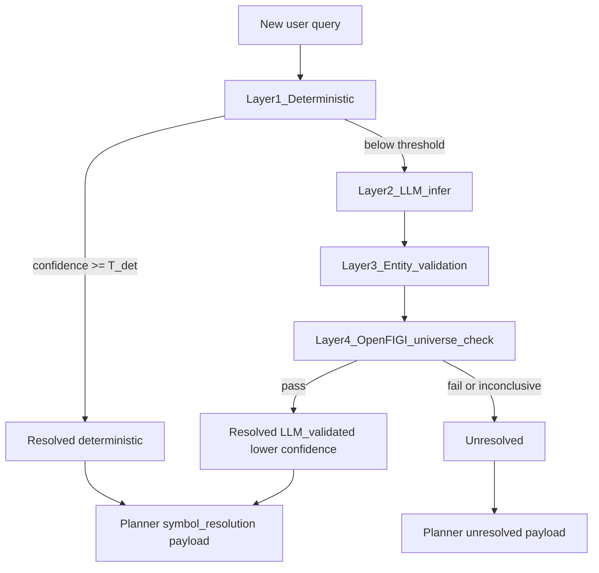

# Layered symbol resolution pipeline (plan)

This document supersedes the earlier “centralize typo aliases in `util/ticker_aliases`” slice with a **full layered design**: deterministic resolution first, then LLM fallback with **grounded validation**, then **OpenFIGI** as the trusted symbol universe. Implementation should live primarily under [`util/planner_symbol_resolution.py`](../../../util/planner_symbol_resolution.py) and new focused modules; the planner remains the consumer that attaches `symbol_resolution` to specialist ACL messages.

## Goals

- **Deterministic first**: curated aliases, company names, and tickers, plus **fuzzy** matching for minor misspellings (e.g. `NVDIA` → `NVDA`), with an explicit **confidence** score.
- **Thresholded fallback**: if no deterministic match meets a configurable threshold, call an **LLM resolver** that infers a candidate symbol from context.
- **LLM path must ground**: the LLM output is **not** accepted until (1) **external validation** ties the ticker to the named entity (e.g. NVIDIA Corporation), and (2) the ticker is **cross-checked** against a **trusted universe** via **OpenFIGI** (user choice for v1).
- **Explicit failure**: if validation fails or is inconclusive, mark **`unresolved`** and do **not** push a guessed ticker to downstream financial tools.

## High-level flow

## Layer 1 — Deterministic symbol resolution

**Inputs:** raw query string (and optionally conversation-scoped hints later).

**Data sources (curated, committed):**

- Extend or consolidate existing JSON: [`database/symbol_resolution_known_issuers.json`](../../../database/symbol_resolution_known_issuers.json), [`database/symbol_resolution_routing.json`](../../../database/symbol_resolution_routing.json).
- Add a dedicated **alias / name / ticker** table file, e.g. [`database/symbol_resolution_aliases.json`](../../../database/symbol_resolution_aliases.json), with entries that support:
  - exact ticker aliases (`NVDIA` → `NVDA`);
  - company / brand strings → primary listing;
  - optional locale variants.

**Fuzzy matching:**

- Apply only on **short tokens** and **known dictionary keys** (company names, alias keys) to limit false positives—e.g. rapidfuzz or stdlib `difflib` against a **closed set** of allowed strings, not the open internet.
- Emit **confidence** in `[0, 1]` (e.g. 1.0 exact alias, <1.0 fuzzy with distance-based mapping).

**Output shape (conceptual):**

- `tier`: `deterministic`
- `confidence`: float
- `normalized_ticker` / listings compatible with current `listings` + `by_tool` builder
- `reason_codes`: e.g. `exact_alias`, `fuzzy_company_name`

**Threshold:** `SYMBOL_RESOLUTION_DETERMINISTIC_MIN_CONFIDENCE` (env or config module); if best score &lt; threshold, proceed to Layer 2.

## Layer 2 — LLM inference (fallback only)

**Trigger:** deterministic best confidence &lt; `T_det` **or** no candidate.

**Behavior:**

- Structured prompt: extract **candidate symbol(s)**, **entity name as stated in query**, and **short rationale** (for logs only, not user-facing truth).
- **No direct handoff to markets**: LLM output is **provisional** until Layers 3–4 pass.

**Output (provisional):**

- `candidate_symbol`, `inferred_entity_name`, `llm_confidence` (optional, separate from final confidence).

## Layer 3 — External entity validation (grounding)

**Requirement:** confirm that **candidate_symbol** corresponds to the **target entity** (e.g. NVDA ↔ NVIDIA Corporation).

**v1 options (compose at least one):**

- **API lookup:** e.g. Yahoo quote / profile fields via existing MCP tools (`yahoo_finance_tool.get_price` or fundamental/chart path) — use **returned long name / symbol** string match against inferred entity (deterministic string rules + optional fuzzy on name).
- **Search-assisted check:** if the project already has a bounded web/news path, use it only to retrieve **factual snippets** (titles/snippets), not free-form model prose as sole proof.

**Evidence object (stored in resolution payload):**

- `validation_method`: e.g. `yahoo_profile`, `search_snippet`
- `evidence_summary`: non-PII, short text
- `matched_fields`: e.g. `{"symbol": "NVDA", "long_name": "NVIDIA Corporation"}`

If this layer **cannot** establish a defensible link, **do not** proceed to “resolved”; either retry another candidate or mark **unresolved**.

## Layer 4 — Trusted universe cross-check (OpenFIGI)

**Source:** [OpenFIGI API](https://www.openfigi.com/api) (user-selected for v1 trusted universe).

**Behavior:**

- Map `(ticker, optional MIC/exchange hint)` → FIGI / listing identity; verify the instrument type and primary listing align with planner intent (equity vs ETF, etc.).
- Treat OpenFIGI **non-match** or **ambiguous multi-match** without disambiguation as **failure** for resolution (mark unresolved or require user clarification in product terms).

**Config:**

- **Credential:** read the OpenFIGI API key from the environment variable **`OPENFIGI_API_KEY`** (e.g. set in [`.env`](../../../.env) at repo root for local runs; same variable name in production/staging secrets).
- Implementation must use `os.environ.get("OPENFIGI_API_KEY")` (or the project’s existing env-loading pattern so `.env` is applied before resolution runs). **Do not** hardcode keys or commit them.
- If the key is missing when Layer 4 is required, treat OpenFIGI as **unavailable**: either skip to **`unresolved`** for the LLM path or document a deliberate “degraded mode” (plan should pick one behavior during implementation).
- Document the variable in backend/env examples (e.g. `.env.example` if present) and in [`backend.md`](backend.md).

**Payload:**

- `openfigi`: `{ "figi": "...", "name": "...", "security_type": "...", "raw": ... }` (trim raw for size)

## Final resolution object and confidence policy

| Outcome | `status` | Final `confidence` | Notes |
|---------|----------|--------------------|--------|
| Layer 1 pass | `resolved` | high (e.g. ≥ 0.9 band) | Single canonical listings + `by_tool` |
| Layers 2–4 pass | `resolved` | **strictly lower** than deterministic floor for same nominal certainty | Tag `source`: `llm_openfigi_validated` |
| Any hard failure | `unresolved` | n/a | No ticker pushed to price/SQL/analyst locks |

**Schema:** bump `SYMBOL_RESOLUTION_SCHEMA_VERSION` and extend the dict produced by `resolve_symbol_resolution_for_query` (and cache entries) with:

- `resolution_tier`: `deterministic` | `llm_validated` | `unresolved`
- `confidence`: float
- `validation`: `{ entity_validation: ..., openfigi: ... }` (omit sensitive data)

## Planner and downstream behavior

- **Resolved:** unchanged in spirit—attach full `symbol_resolution` to librarian / websearcher / analyst; specialist symbol lock continues to use listings.
- **Unresolved:** planner should **not** populate financial `by_tool` call entries with a guessed symbol; use `skip` / `reason_code` such as `symbol_unresolved`, and pass text guidance into decomposition so the responder can ask for a clearer symbol or exchange.

## Code organization (suggested)

| Piece | Location |
|-------|----------|
| Layer 1 curated load + fuzzy | `util/symbol_resolution_deterministic.py` (new) |
| OpenFIGI client | `openfund_mcp/tools/openfigi_tool.py` or `util/openfigi_client.py` (new) |
| LLM resolver + orchestration | `util/symbol_resolution_llm.py` (new); inject `LLMClient` from planner or lazy import |
| Orchestrator + existing `by_tool` | extend [`util/planner_symbol_resolution.py`](../../../util/planner_symbol_resolution.py) |

**Import hygiene (done):** `extract_symbol_from_query` and `merge_catalog_symbols_for_query` live in [`util/symbol_query_extract.py`](../../../util/symbol_query_extract.py). `util/planner_symbol_resolution.py` does not import `agents`. WebSearcher delegates `_normalize_symbol` to `extract_symbol_from_query`.

## Testing

- Unit: Layer 1 exact + fuzzy thresholds; OpenFIGI client mocked.
- Integration (mocked HTTP): full pipeline deterministic pass; LLM + mocked Yahoo + mocked OpenFIGI pass; OpenFIGI miss → `unresolved`.
- Regression: `NVDIA` query → deterministic `NVDA` when alias/fuzzy configured.

## Documentation and ops

- Update [`backend.md`](backend.md): resolution states, env vars — explicitly **`OPENFIGI_API_KEY`** (loaded from `.env` locally), plus confidence thresholds.
- Update [`file-structure.md`](file-structure.md) for new modules/tools.
- [`CHANGELOG.md`](../../../CHANGELOG.md) when behavior is user-visible.

## Non-goals (this iteration)

- Replacing all of [`agents/websearch_agent.py`](../../../agents/websearch_agent.py) symbol heuristics—only ensure planner-owned resolution is authoritative for **conversation-scoped** financial routing.
- Stooq SSL retries and Alpha Vantage cooldowns (operational, separate).

---

*Status: **implemented** (v1 in code); see `util/planner_symbol_resolution.py` and related `util/symbol_resolution_*.py` modules.*
