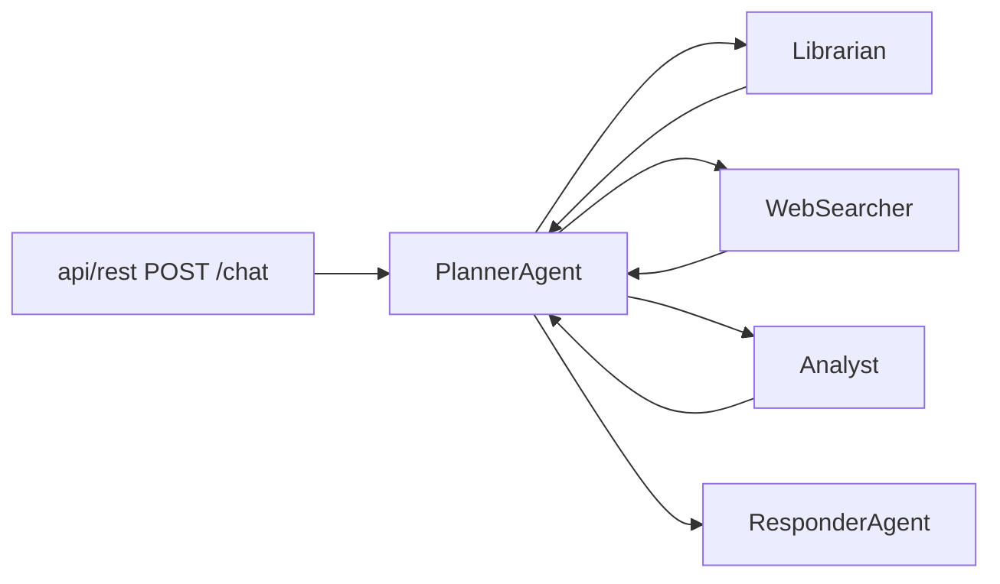

# OpenFund AI — Research aggregation and partial answers (roadmap)

This document is the **working roadmap** for reducing unnecessary “Insufficient information” outcomes and improving multi-entity research quality. It complements (does not replace) product and architecture docs:

- [docs/workflow/90_product/prd.md](docs/workflow/90_product/prd.md) — what the system must do
- [docs/workflow/02_planning/backend.md](docs/workflow/02_planning/backend.md) — orchestration, ACL, `symbol_resolution`, persistence
- [docs/workflow/90_product/progress.md](docs/workflow/90_product/progress.md) — stages, tests, changelog pointers

Further implementation detail lives in [docs/workflow/02_planning/file-structure.md](docs/workflow/02_planning/file-structure.md) and repo root [CHANGELOG.md](CHANGELOG.md).

---

## Problem (symptom)

The system sometimes returns **“Insufficient information”** even when **useful data already exists** across Librarian, WebSearcher, or Analyst (e.g. prices and summaries for SPY and China Vanke in `normalized_fund`, while the final user message is still generic insufficient text).

**Example scenario**

User: *Should I invest in SPY and China Vanke? What’s the historical performance?*

Observed failure mode:

- WebSearcher may return real quotes and summaries for multiple symbols.
- Librarian/SQL/KG may be sparse (no time series, empty `stock_ohlcv`, etc.).
- Planner still ends on **insufficient** after rounds or the client **times out (408)** before all agents finish.
- User sees **Insufficient information** instead of a **partial, caveated** answer.

---

## Architecture (ground truth)

1. **Planner** decomposes the user query into specialist steps (`decompose_task` → `llm/live_client.py` `decompose_to_steps` with [llm/prompts.py](llm/prompts.py) `PLANNER_DECOMPOSE`).
2. **Specialists** return **INFORM** payloads; planner holds **`_collected`** per conversation.
3. When a round completes, planner builds **`_format_final(collected)`** → string passed to Responder as **`final_response`**, and persists **bounded snapshots** via **`merge_data_sources`** / [util/specialist_snapshot.py](util/specialist_snapshot.py) into **`data_sources`** on [a2a/conversation_manager.py](a2a/conversation_manager.py) conversation records.
4. **Sufficiency** is an **LLM binary** check in the planner (`_check_sufficiency` + `PLANNER_SUFFICIENCY`), not in the Responder. If insufficient and rounds remain, planner may dispatch **round 2** refined queries; if still insufficient after **`MAX_RESEARCH_ROUNDS`**, planner sets **`final_response`** to **“Insufficient information.”** and **`insufficient: true`**.
5. **Responder** ([agents/responder_agent.py](agents/responder_agent.py)): when **`insufficient`** is true, it **forces** the exact string **“Insufficient information.”**, bypassing richer drafts.

---

## Already implemented (do not re-specify from scratch)

| Area | What exists | Primary locations |
|------|-------------|-------------------|
| **Symbol resolution** | Listings, `symbol_type`, `by_tool` (per MCP tool), `schema_version` 3; tool/market registry + cache file under `MEMORY_STORE_PATH` | [util/planner_symbol_resolution.py](util/planner_symbol_resolution.py) |
| **Committed catalogs** | Known issuers + routing (phrases/symbols → cache key; `ticker_symbol_types` hints). **Target:** types must match graph dataset buckets (see below). | [database/symbol_resolution_known_issuers.json](database/symbol_resolution_known_issuers.json), [database/symbol_resolution_routing.json](database/symbol_resolution_routing.json) |
| **Planner wiring** | Resolve + cache before `decompose_task`; attach **`symbol_resolution`** on specialist REQUESTs | [agents/planner_agent.py](agents/planner_agent.py) |
| **WebSearcher** | Honors `by_tool`; multi-symbol from query + fund catalog; Yahoo payload per iteration symbol; SPY vs SPX phrase handling | [agents/websearch_agent.py](agents/websearch_agent.py) |
| **Aggregation string** | **`_format_final`**: librarian + websearcher + analyst into one narrative for responder | [agents/planner_agent.py](agents/planner_agent.py) |
| **Persisted snapshots** | **`data_sources`** on conversations (librarian / websearcher / analyst) | [util/specialist_snapshot.py](util/specialist_snapshot.py), [a2a/conversation_manager.py](a2a/conversation_manager.py) |
| **Sufficiency / round 2** | `PLANNER_SUFFICIENCY`; refined steps from `PLANNER_REFINED_QUERIES` pattern | [llm/prompts.py](llm/prompts.py), [agents/planner_agent.py](agents/planner_agent.py) |
| **Decomposition hygiene** | Today’s UTC date prepended to decompose input; rule not to invent calendar years in sub-queries | [llm/live_client.py](llm/live_client.py), `PLANNER_DECOMPOSE` in [llm/prompts.py](llm/prompts.py) |
| **KG: isolated nodes** | `get_relations` falls back to `MATCH (e) WHERE …` when no `(e)-[r]-(other)` matches | [openfund_mcp/tools/kg_tool.py](openfund_mcp/tools/kg_tool.py) |
| **Librarian KG merge** | Merges `get_relations`, `fulltext_search`, `query_graph`, `get_node_by_id` into `graph` | [agents/librarian_agent.py](agents/librarian_agent.py) |

**Tests to run when touching this area**

- `PYTHONPATH=. pytest tests/test_symbol_resolution.py -v`
- `PYTHONPATH=. pytest tests/test_websearch_symbol_extract.py -v`
- `PYTHONPATH=. pytest tests/test_kg_tool.py -v` (includes `get_relations` isolated fallback)

### Symbol type taxonomy (graph / dataset alignment)

During symbol resolution, **`symbol_type` must be one of a closed set** so planner output, routing JSON, and downstream **Neo4j / SQL dataset boundaries** stay consistent (same classification buckets as in graph data):

| Allowed `symbol_type` | Use |
|-----------------------|-----|
| `cryptos` | Crypto instruments |
| `currencies` | FX / currency pairs or currency-denominated spot-like symbols where modeled that way |
| `equities` | Single-name stocks / ADRs |
| `etfs` | Exchange-traded funds |
| `funds` | Mutual funds and other non-ETF fund vehicles |
| `indices` | Benchmark indices (e.g. SPX-style), not the ETF wrapper |
| `moneymarkets` | Money-market / cash-like instruments where your graph models them separately |

**Implementation status:** [util/planner_symbol_resolution.py](util/planner_symbol_resolution.py) normalizes to the seven buckets + `unknown`; legacy JSON `etf` / `stock` map to `etfs` / `equities`. `schema_version` **3** invalidates older caches. REQUESTs include `resolution_listings` / `resolution_symbol_type` / `resolution_canonical_name` when resolved.

---

## Root causes (aligned with this codebase)

Past generic causes are refined as follows:

1. **Binary sufficiency + forced insufficient text** — The planner’s LLM may return **INSUFFICIENT** even when **`_format_final`** could already support a useful answer. After max rounds, planner **replaces** `final` with **“Insufficient information.”** and the Responder **enforces** that string when `insufficient` is set. This is stricter than “best effort partial answer.”

2. **Sufficiency input may under-represent WebSearcher signal** — **`_format_aggregated_for_sufficiency`** leans on per-agent **`summary`** and light markers; it may not surface **`normalized_fund`** prices as clearly as the user-facing **`_format_final`** path. The sufficiency model may disagree with what a human would call “enough.”

3. **Multi-entity consistency** — There is no single JSON **`{ "entities": [...] }`** passed everywhere. The closest shared artifact is **`symbol_resolution`** (often **primary-listing** oriented for `by_tool`) plus **per-step decomposed `query`** and WebSearcher’s **multi-symbol** resolution. Secondary tickers still depend on decomposition wording and catalog behavior. Until **`symbol_type`** uses only the **graph-aligned** set (`cryptos`, `currencies`, `equities`, `etfs`, `funds`, `indices`, `moneymarkets`), KG/SQL routing may not match how nodes are partitioned in Neo4j.

4. **Operational limits** — **POST /chat timeouts (408)** if MCP/LLM calls exceed `e2e_timeout_seconds`; **external API rate limits** (e.g. analyst / news) produce errors that flow into summaries and sufficiency. These are not fixed by copy alone.

5. **No graded “partial” tier in code** — Product desire for **low / medium / high** data quality exists only as a **design goal** below; implementation remains **SUFFICIENT / INSUFFICIENT** plus the insufficient flag.

---

## Gap table (original plan vs repo)

| Original plan idea | Status in OpenFund AI |
|--------------------|------------------------|
| Explicit JSON `{ "entities": [...] }` from a “normalization step” | **Not implemented**; use **`symbol_resolution`** + WebSearcher multi-symbol + decomposition. |
| Same entity list on every agent as `entities: [...]` | **Partial** — shared **`symbol_resolution`** + specialist **`query`**; no unified `entities` array in ACL. |
| Unified `combined_data` object before respond | **Partial** — planner **`_collected`** and persisted **`data_sources`**; Responder receives **`final_response` string**, not a structured `combined_data`. |
| Graded sufficiency + partial answers in **Responder** | **Partial** — sufficiency stays in **Planner**; **`partial_insufficient`** lets Responder keep a caveated **`_format_final`** instead of forcing only “Insufficient information.” |
| “Fix in: LLM normalization step” | **Misleading** — decomposition is **`decompose_to_steps`** + **`PLANNER_DECOMPOSE`**; symbol resolution is **`planner_symbol_resolution`** + JSON files. |
| Graph-aligned instrument class | **Implemented** — `schema_version` **3**; seven buckets + `unknown`; legacy **`etf` / `stock`** in JSON normalize to **`etfs` / `equities`**. |

---

## Roadmap (phased)

### Phase A — Prompt and sufficiency input (low risk)

**Goal:** When WebSearcher (and summaries) already contain answer-bearing signal, bias the sufficiency model toward **SUFFICIENT** unless a follow-up round is clearly needed.

- Tighten **`PLANNER_SUFFICIENCY`** in [llm/prompts.py](llm/prompts.py) (e.g. explicit: “If the user asked for comparison and at least one relevant price or summary exists for each named instrument, prefer SUFFICIENT with caveats in the eventual answer.”).
- Enrich **`_format_aggregated_for_sufficiency`** in [agents/planner_agent.py](agents/planner_agent.py) to include short structured cues from **`normalized_fund`** (symbols + prices) when present, not only `summary` text.

### Phase B — Partial answer behavior (medium risk)

**Goal:** Avoid replacing a useful **`_format_final`** draft with the single phrase **“Insufficient information.”** when some signal exists.

- In [agents/planner_agent.py](agents/planner_agent.py): when marking insufficient after max rounds, either pass **`_format_final`** output with a **fixed caveat prefix/suffix**, or introduce a small **tier enum** (e.g. `none` / `partial` / `full`) and branch.
- In [agents/responder_agent.py](agents/responder_agent.py): stop **unconditionally** overwriting with **“Insufficient information.”** when `insufficient` is true **if** policy allows partial body (coordinate with OutputRail and disclaimers).

### Phase C — Structured multi-entity (optional, larger scope)

**Goal:** First-class list of instruments for librarian SQL hints and KG queries, not only primary `symbol_resolution`.

- Extend planner REQUEST **`content`** (or prompts) with **`listings`** / **`entities`** derived from resolution + decomposition, so Librarian/Analyst can target **000002.SZ**, **2202.HK**, **SPY** explicitly without relying solely on LLM-chosen sub-query wording.
- **Unify `symbol_type` with graph datasets:** Replace the current `etf` / `stock` / `unknown` normalization with the **seven** labels above everywhere they appear (Python `_normalize_symbol_type`, JSON catalogs, cache schema). Use **`indices` vs `etfs`** consistently (e.g. SPX vs SPY) so WebSearcher and librarian KG queries follow the same rules as your graph import pipelines.

---

## Example: desired user-visible behavior

**Input:** SPY vs China Vanke; partial data (prices + narrative; no full shared time series in SQL).

**Good:** A response that states what is known (e.g. latest prices, risk contrast, data gaps), with **“not investment advice”** alignment to [safety/safety_gateway.py](safety/safety_gateway.py) (`OutputRail`).

**Bad:** Only **“Insufficient information.”** when **`normalized_fund`** already contains both symbols with prices.

---

## Success criteria (measurable)

1. **Fixture / integration:** Given a synthetic **`collected`** map that includes WebSearcher **`normalized_fund`** with two distinct symbols matching the user question, the planner path must **not** set **`insufficient`** without a **documented explicit policy** (e.g. user asked for something impossible with available tools).
2. **User-visible:** In the above scenario, the stored **`final_response`** (after OutputRail) is **not** exactly the single sentence **“Insufficient information.”** — it must include at least one **concrete fact line** (e.g. price or summary snippet) or a **clear partial-answer** template.
3. **Multi-entity:** For a logged conversation comparing two named tickers, **`data_sources.websearcher.normalized_fund_brief`** (or equivalent) reflects **both** instruments when tools succeeded (already observable in persistence today).
4. **Regressions:** `pytest tests/test_symbol_resolution.py`, `tests/test_websearch_symbol_extract.py`, and relevant planner/stage tests still pass after changes.
5. **Symbol types:** Resolved `symbol_type` values in cache and ACL are always exactly one of **`cryptos`**, **`currencies`**, **`equities`**, **`etfs`**, **`funds`**, **`indices`**, **`moneymarkets`** — matching the graph dataset classification — with no ad-hoc strings (e.g. legacy `stock` / `etf` once migration is done).

---

## Design principle (unchanged goal)

**Prefer the best possible answer from available evidence**; reserve hard failure for **near-zero signal** or policy blocks — implemented in Phase A/B above, not by duplicating legacy generic steps.

---

## Summary

Much of the **orchestration, symbol resolution, aggregation string, persistence, and KG edge cases** is already in the repo. Remaining work is **targeted**: sufficiency prompt + aggregated context (**Phase A**), then **partial-answer policy** in planner/responder (**Phase B**), optionally **structured multi-entity** content plus **graph-aligned `symbol_type`** (**Phase C**). No new data source is strictly required for Phase A–B; **timeouts and vendor rate limits** remain operational constraints.
